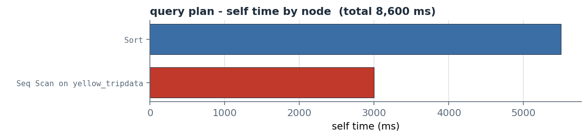
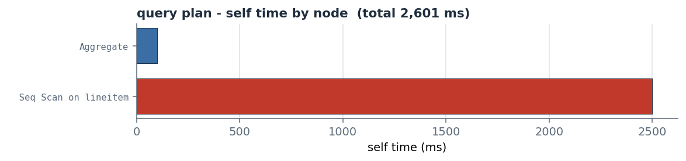
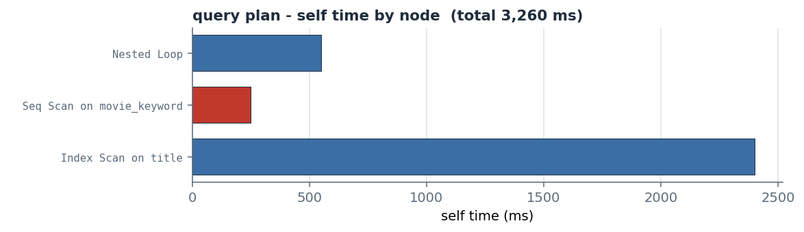
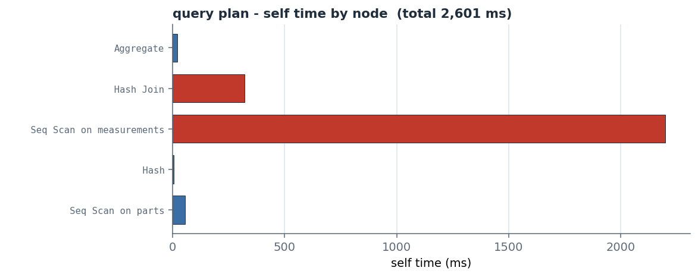
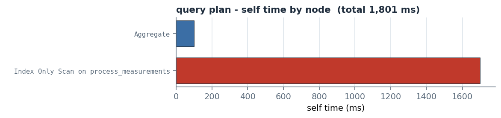
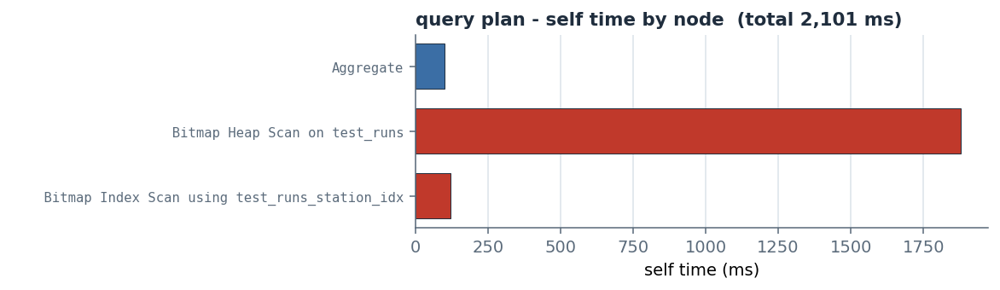
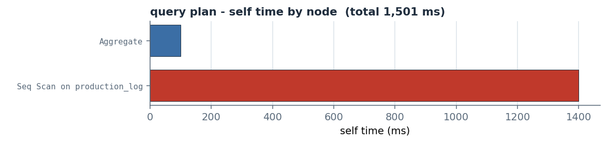

# dataxplan

[](https://github.com/arikanatakan/dataxplan/actions/workflows/ci.yml)
[](https://pypi.org/project/dataxplan/)
[](LICENSE)

Read PostgreSQL `EXPLAIN` plans from Python: parse the plan, compute the numbers
people misread (self time and estimation error), flag documented problems,
compare plans, and guard them in CI. **No database connection, nothing leaves
your machine, deterministic output.**

You give it the output of `EXPLAIN (ANALYZE, BUFFERS, FORMAT JSON) ...`; it does
the rest locally.


## Problem

A slow query's only honest explanation is in its `EXPLAIN` plan, but reading that
plan by hand is hard and easy to get wrong. The reported times are per loop and
inclusive of children, so the node that is actually slow is rarely the obvious
one, and the row estimate that is off by orders of magnitude (the usual root
cause of a bad plan) is buried in the output. The tools that read plans well are
web pastebins, which means sending a production plan, with its table names and
filter values, to someone else's server, or commercial SaaS. None of them run
inside your own script, your tests, or your CI.

## Purpose

dataxplan reads the plan for you, locally and deterministically. From the output
of `EXPLAIN (ANALYZE, BUFFERS, FORMAT JSON)` it builds the plan tree, computes the
numbers people misread (self time, estimation error, disk spills), flags
documented problems with an explanation and a suggested action, compares two
plans for regression, and lets you assert on a plan in CI so a change that
degrades it fails the build. It needs no database connection, has no runtime
dependencies, and every result is reproducible. The findings are documented
heuristics, not guarantees, and the analysis is of the plan you provide.

## Methodology

The metrics are computed directly from the fields PostgreSQL documents for
`EXPLAIN (ANALYZE, BUFFERS, FORMAT JSON)`, so they are arithmetic on the plan,
not numbers of our own. For a node `n` with children `C(n)`:

- de-looped total (inclusive) time:
  `total(n) = Actual Total Time(n) × Actual Loops(n)`
- self (exclusive) time, the work done at the node itself:
  `self(n) = total(n) − Σ total(c) for c in C(n)`
- share of the query's time:
  `pct(n) = self(n) / Execution Time`
- row estimation error, per loop (both counts floored at 1):
  `factor(n) = Actual Rows(n) / Plan Rows(n)` and
  `error(n) = max(factor(n), 1 / factor(n))`
- a sort or hash spilled to disk when `Sort Method` contains `external`, or
  `Hash Batches > 1`, or `Temp Written Blocks > 0`.

`Actual Total Time` is reported per loop and inclusive of children, which is why
both the de-looping (`× Actual Loops`) and subtracting the children matter:
together they reveal the node where the time is actually spent, not the one at
the top of the plan. The findings are documented heuristics applied on top of
these metrics (sources in [References](#references-and-validation)); they are
pointers, not guarantees.

It turns a plan into a deterministic read. Here the Bosch manufacturing example
(`examples/`): a hash join over a 48-million-row scan of the production-line
measurements, estimated at 300 rows but producing 288,000 ([Bosch Production Line
Performance](https://www.kaggle.com/competitions/bosch-production-line-performance)):

```text
dataxplan
  execution time   2,601.00 ms   (planning 0.50 ms)
  nodes 5, depth 3
  worst row estimate   960x off
  spilled to disk      no
  top by self time:
    Seq Scan on measurements         2,200.00 ms (85%)
    Hash Join                        320.00 ms (12%)
    Seq Scan on parts                55.00 ms (2%)
    Aggregate                        20.00 ms (1%)
    Hash                             5.00 ms (0%)
findings:
  [HIGH] Hot sequential scan  (Seq Scan on measurements)
      sequential scan is 85% of execution time, reading 48,000,000 rows
      -> consider an index supporting the filter or join on measurements
  [HIGH] Row estimate is far off  (Hash Join)
      estimated 300 rows, actual 288,000 (960x under-estimate)
      -> run ANALYZE on the table; if the columns are correlated consider extended statistics
  [MEDIUM] Filter discards most rows read  (Seq Scan on parts)
      removed 1,194,000 rows by filter but kept only 6,000
      -> the predicate is not selective via the current access path; an index may help
```

## Install

```bash
pip install dataxplan
```

No runtime dependencies. The chart is optional (`pip install "dataxplan[viz]"`).

## Quick start

```python
import dataxplan

report = dataxplan.analyze(explain_json)   # the EXPLAIN (FORMAT JSON) output
print(report.summary())                    # the summary shown above
```

### From the command line

```bash
dataxplan plan.json                       # summary
dataxplan plan.json --tree                # also the annotated plan tree
dataxplan plan.json --json                # the full report as JSON
dataxplan before.json --compare after.json
psql -XqAt -c "EXPLAIN (ANALYZE, BUFFERS, FORMAT JSON) <query>" | dataxplan
```

### Guard a plan in CI

Pin a critical query's plan in your test suite, so a code or schema change that
makes it regress fails the build. Nothing else in Python does this.

```python
def test_orders_lookup_stays_fast():
    report = dataxplan.analyze(get_explain("SELECT * FROM orders WHERE customer_id = %s"))
    assert not report.has_seq_scan_on("orders")
    assert report.max_estimation_error < 100
    assert not report.spilled_to_disk
```

### Compare two plans (before / after an index)

```python
print(dataxplan.compare(before_json, after_json).summary())
# dataxplan compare - IMPROVED
#   execution time   905.00 ms -> 0.08 ms (-100%)
#   resolved         filter_discard, seq_scan_hot
```

### Sharper findings with catalog context (optional)

```python
from dataxplan import Context, TableInfo
ctx = Context(tables={"orders": TableInfo("orders", row_count=10_000_000,
                                          indexed_columns=("id",))})
dataxplan.analyze(explain_json, context=ctx)
```

### Fetch a plan from a connection you already have (optional)

```python
plan = dataxplan.run_explain(conn, "SELECT * FROM orders WHERE id = %s", params=(42,))
dataxplan.analyze(plan)
```

`run_explain` calls `cursor.execute` on a DB-API connection you pass (psycopg,
psycopg2, ...); dataxplan does not depend on any driver. With `analyze=True` it
runs the query, so use `analyze=False` for a plan-only estimate.

## What it covers

| Area | What you get |
| --- | --- |
| Parse | `parse` -> a typed `Plan` / `PlanNode` tree from EXPLAIN JSON, text, YAML or XML (auto-detected) |
| Metrics | self (exclusive) time, % of total, estimation error, disk spills, buffers |
| Findings | hot sequential scans, large row mis-estimates, disk spills, filter discards, nested-loop blow-ups, index-only heap fetches, lossy bitmaps, JIT overhead |
| Report | `summary`, `to_dict`, and an assertion API (`has_seq_scan_on`, `max_estimation_error`, `spilled_to_disk`, `ok`) for CI |
| Compare | `compare` two plans for regression (timing, shape, estimates, findings) |
| Render | `text_tree` (annotated, dependency-free) and `plan_tree_chart` (needs matplotlib) |
| Context | optional catalog metadata (sizes, indexes, stale stats) that sharpens findings |
| CLI | `dataxplan plan.json` (or stdin): summary, `--tree`, `--json`, `--compare` |

## Examples

Seven plans from public datasets and benchmarks (in [`examples/`](examples/)),
ordered here from the largest data set to the smallest. Each chart shows self
time per node, with the high-severity findings in a warning colour. The benchmark
and NYC sets are large in their own right; the semiconductor, automotive and
textile sets are smaller research samples of domains that run at production
scale, so those plans model a production-size query. Sizes and times are
illustrative.

### NYC TLC Yellow Taxi - a sort that spills to disk

The [NYC TLC trip records](https://www.nyc.gov/site/tlc/about/tlc-trip-record-data.page)
are a public, multi-billion-row data set. Ordering long trips by fare, dataxplan
flags `disk_spill` (an external-merge sort) over a hot sequential scan
(`seq_scan_hot`).



The red bar is the sequential scan feeding the sort, and the sort then overflowed
memory to disk. **Action:** index the filter so the scan shrinks, or raise
`work_mem` (or pre-aggregate) so the sort stays in memory.

### TPC-H lineitem - a hot scan discarding most rows

[TPC-H](https://www.tpc.org/tpch/) is the standard decision-support benchmark,
scalable to hundreds of gigabytes. A selective predicate on `l_quantity` flags
`seq_scan_hot` and `filter_discard` (59 million rows read, 2 million kept).



Almost all the time is one scan that reads 59 million rows to keep 2 million.
**Action:** add an index on the filtered column so the predicate is served by the
index instead of a full scan.

### IMDB / Join Order Benchmark - a row mis-estimate

The [Join Order Benchmark](https://github.com/gregrahn/join-order-benchmark)
(Leis et al., VLDB 2015) is the standard cardinality-estimation benchmark.
dataxplan flags `estimate_off` (2 rows estimated, 480,000 actual) and
`nested_loop_blowup`.



The estimate was 2 rows but the join produced 480,000, so the planner chose a
nested loop that ran 480,000 times (the inner scan is the red bar). **Action:**
run `ANALYZE` and add extended statistics so a hash or merge join is chosen.

### Bosch Production Line Performance (manufacturing) - a hash join mis-estimate

The [Bosch Production Line Performance](https://www.kaggle.com/competitions/bosch-production-line-performance)
set is large public manufacturing data. dataxplan flags a hot 48-million-row scan
(`seq_scan_hot`), a 960x join mis-estimate (`estimate_off`) and a filter
discarding most rows (`filter_discard`).



The 48-million-row `measurements` scan is the bottleneck (red) and the join
estimate is 960x too low. **Action:** index or partition `measurements` by part
or station, and refresh statistics so the join is planned correctly.

### SECOM (semiconductor) - an index-only scan hitting the heap

[SECOM](https://archive.ics.uci.edu/dataset/179/secom) (UCI) is sensor data from
a semiconductor line. dataxplan flags `index_only_heap_fetches` (9 million heap
fetches, so the table needs a VACUUM) and `estimate_off`.



The index-only scan should skip the table, but it made 9 million heap fetches
because the visibility map is stale. **Action:** `VACUUM` the table so the scan
skips the heap, and `ANALYZE` to fix the row estimate.

### Mercedes-Benz manufacturing (automotive) - a lossy bitmap scan

The [Mercedes-Benz Greener Manufacturing](https://www.kaggle.com/competitions/mercedes-benz-greener-manufacturing)
set (Kaggle) is automotive test-bench data. dataxplan flags `lossy_bitmap` (6
million rows rechecked, so work_mem is too small) and `estimate_off`.



The bitmap did not fit in `work_mem`, so it went lossy and rechecked 6 million
rows. **Action:** raise `work_mem` so the bitmap stays exact, and refresh
statistics for the estimate.

### Garment factory (textile) - a hot scan discarding most rows

The [Productivity Prediction of Garment Employees](https://archive.ics.uci.edu/dataset/597/productivity+prediction+of+garment+employees)
set (UCI) is garment (textile) manufacturing data. dataxplan flags `seq_scan_hot`
and `filter_discard` on the production log.



The `production_log` scan reads 12 million rows to keep 500,000 (red).
**Action:** add an index on the `department` column so the filter uses the index
instead of a full scan.

## Limitations and Constraints

- **PostgreSQL only.** It parses PostgreSQL `EXPLAIN` output (JSON, text, YAML or
  XML, auto-detected); other engines are not supported yet. JSON, YAML and XML are
  exact; the text format is parsed best-effort, so prefer `FORMAT JSON` when you
  can.
- **ANALYZE is needed for timing.** Without `ANALYZE` there are no actual times or
  row counts, so self time, estimation error and the timing-based findings are
  unavailable; the plan still parses and its structure is reported.
- **Plan-only view.** Without the optional context it does not know your schema,
  indexes, statistics or selectivity, so the findings are heuristic pointers, not
  verdicts; some (hot scan, filter discard, nested loop) can be false positives
  when the chosen path is in fact optimal.
- **Thresholds are defaults.** The cut-offs (for example 100x estimation error or
  30% self time) are reasonable calibrations, not universal constants; override
  them with `thresholds=`.
- **One captured run.** EXPLAIN ANALYZE times depend on machine, cache and load, so
  the analysis reflects the run you captured, not an average over runs.
- **One statement at a time.** It analyses a single plan; it does not aggregate a
  workload or parse server logs.

## What is out of scope

dataxplan analyses the **plan you give it**. By default it does not connect to a
database, run your queries, or read your schema, so a finding is a **documented
heuristic, not a guarantee**, and the suggestions are based on the plan alone. It
does not rewrite SQL or invent a cost model. It targets PostgreSQL `EXPLAIN`
output (JSON, text, YAML or XML; MySQL may follow).

## How the headline metrics work

- **Self time.** Postgres reports `Actual Total Time` per loop and inclusive of
  children, so a node's total is `Actual Total Time x Actual Loops`, and its
  self time is that minus the children's totals. Self time is where the work
  really happens.
- **Estimation error.** `Plan Rows` against `Actual Rows` (per loop); a large
  ratio is the usual root cause of a bad plan.

## References and validation

The metric arithmetic is verified by hand against the semantics PostgreSQL
documents (see [`tests/`](tests/)). Each finding is grounded in the documented
behaviour it relies on, written in our own words:

| Finding | Source |
| --- | --- |
| `estimate_off` | PostgreSQL: [planner statistics](https://www.postgresql.org/docs/current/planner-stats.html), [CREATE STATISTICS](https://www.postgresql.org/docs/current/sql-createstatistics.html); Leis et al. (2015) |
| `seq_scan_hot` | PostgreSQL: [Using EXPLAIN](https://wiki.postgresql.org/wiki/Using_EXPLAIN), [Indexes](https://www.postgresql.org/docs/current/indexes.html) |
| `disk_spill` | PostgreSQL: [work_mem](https://www.postgresql.org/docs/current/runtime-config-resource.html) |
| `filter_discard` | PostgreSQL: [Using EXPLAIN](https://wiki.postgresql.org/wiki/Using_EXPLAIN) (Rows Removed by Filter) |
| `nested_loop_blowup` | PostgreSQL: planner join methods; Leis et al. (2015) |
| `index_only_heap_fetches` | PostgreSQL: [Index-Only Scans and Covering Indexes](https://www.postgresql.org/docs/current/indexes-index-only-scans.html) |
| `lossy_bitmap` | PostgreSQL: [work_mem](https://www.postgresql.org/docs/current/runtime-config-resource.html) (lossy bitmap recheck) |
| `jit_overhead` | PostgreSQL: [Just-in-Time Compilation](https://www.postgresql.org/docs/current/jit.html) (`jit_above_cost`) |

Primary references:

- [PostgreSQL documentation: EXPLAIN](https://www.postgresql.org/docs/current/sql-explain.html)
  and the [Using EXPLAIN](https://wiki.postgresql.org/wiki/Using_EXPLAIN) wiki page.
- V. Leis, A. Gubichev, A. Mirchev, P. Boncz, A. Kemper, T. Neumann, "How Good
  Are Query Optimizers, Really?", Proceedings of the VLDB Endowment 9(3), 2015 -
  the study of cardinality mis-estimation behind the Join Order Benchmark, which
  the `estimate_off` finding detects (see the JOB example in
  [`examples/`](examples/)).

Plan analysis has no single numeric ground truth the way a closed-form formula
does, so the claim here is deliberately narrow: the parsing and arithmetic are
correct against the documented format, each finding cites the behaviour it relies
on, and the suggestions are pointers, not guarantees.

## License

MIT. Written and maintained by [Atakan Arikan](https://github.com/arikanatakan),
MSc Student at Tsinghua University and Politecnico di Milano.
